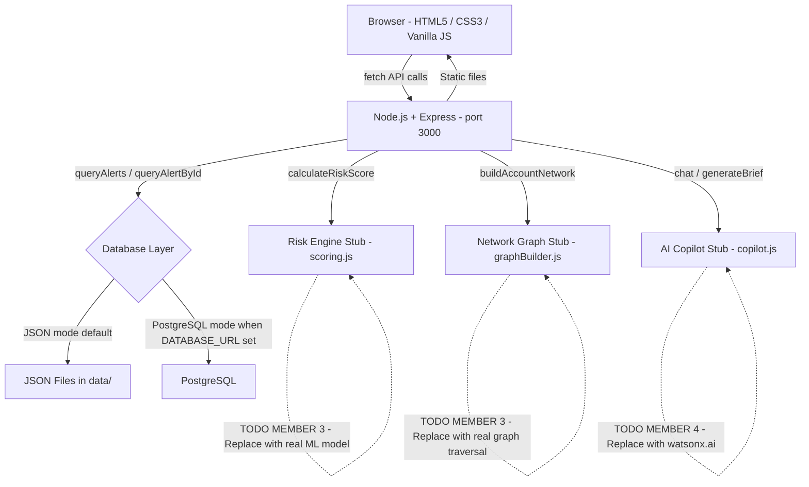

# Architecture

## System Architecture

## Components

| Component | Technology | Responsibility |
|---|---|---|
| Frontend | HTML5, CSS3, Vanilla JavaScript | Dashboard, Alerts Queue, Alert Details workspace, Network Graph, Investigations, Reports, Charts |
| API Server | Node.js + Express.js | REST API, static file serving, request validation, error handling |
| Database Layer | JSON File Store / PostgreSQL | Dual-mode data persistence; auto-selected by `DATABASE_URL` env var |
| Risk Engine | JavaScript stub | Multi-factor risk scoring; returns 6 factors per alert; benchmark returns 94/CRITICAL |
| Network Builder | JavaScript stub | Returns vis-network compatible node/edge graph; benchmark returns A001→A023→A051/A072 |
| AI Copilot | JavaScript stub | Case-aware chat and investigation brief generation; placeholder for watsonx.ai |
| Synthetic Data | Node.js generator | 600 accounts, 11200+ transactions, 240 alerts including benchmark case ALT-10482 |

## Data Flow

1. Investigator opens Alert Details for `ALT-10482`
2. Frontend calls `GET /api/alerts/ALT-10482`
3. Express router calls `db.queryAlertById('ALT-10482')` — returns alert, transaction, account, risk factors, recent transactions, preceding sequence, investigation
4. Router calls `calculateRiskScore(alert, transaction, account)` — returns `{totalScore:94, riskLevel:"CRITICAL", factors:[...]}`
5. Router calls `buildAccountNetwork('A001', 1)` — returns `{nodes:[A001,A023,A051,A072], edges:[...]}`
6. Combined response returned to frontend as single JSON object
7. Frontend renders all sections; progress bars animate on load
8. Investigator sends copilot message → `POST /api/copilot/chat` → stub returns contextual placeholder response
9. Investigator clicks Escalate → `POST /api/investigations/ALT-10482/escalate` → DB writes status → UI updates status badge immediately

## Security Considerations

- API keys and database credentials stored in `.env` (excluded from git via `.gitignore`)
- No `.env` file committed — only `.env.example` with safe placeholder values
- All PostgreSQL queries use parameterized statements (no string concatenation)
- Stack traces never exposed to API consumers — global `errorHandler` middleware returns clean `{ error: message }` only
- Input validation on all query parameters (riskLevel enum, status enum, pagination ranges)
- Notes field truncated at 2000 characters to prevent oversized payloads

## Scalability Notes

The Node.js backend is stateless and can be horizontally scaled behind a load balancer. The JSON file store is not suitable for concurrent writes in a multi-instance deployment — switch to PostgreSQL (`DATABASE_URL`) for any multi-user or multi-instance scenario. The stub integrations (risk engine, network, copilot) are isolated modules that can be replaced independently without touching the API contract.
