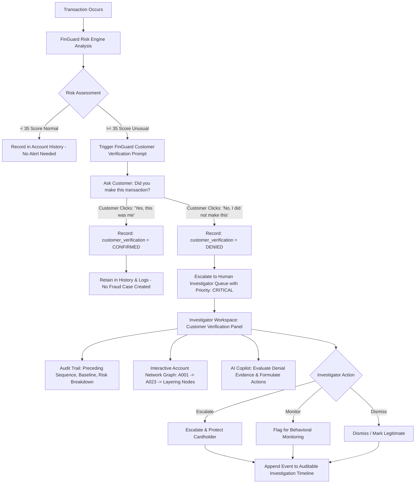

# Solution Overview

## What We Built

FinGuard is an enterprise-grade, AI-powered Bank Fraud and AML Investigation Operations platform. It provides a single investigator workspace where every piece of evidence — risk score, transaction details, customer behavioral baseline, account network graph, and AI-generated analysis — is available on one screen. Investigators no longer need to navigate between systems.

## Customer Verification & Fraud Investigation Workflow

The core purpose of FinGuard is not to replace existing core banking or transaction monitoring systems, but to serve as an intelligent, interactive investigation layer. When unusual activity is detected, FinGuard asks the account owner for confirmation before escalating customer-denied transactions to human fraud investigators.



## How It Works

1. **Transaction Simulation & Risk Analysis** — Transactions are analyzed against multi-factor behavioral baselines (amount deviation, unusual hour 02:17 AM, geographical velocity, new device iPhone 14 Pro, network layering). If risk score < 35, it is recorded normally. If risk score >= 35, verification is required (`PENDING`).

2. **Customer Portal & AI Copilot Prompt** — When an account owner logs in or receives an alert prompt in their Customer Portal (`/customer` or `customer-portal.html`), FinGuard displays the unusual transaction details and asks: *"Did you make this transaction?"*.
   - **YES ("Yes, this was me")**: FinGuard records `customer_verification: "CONFIRMED"`, updates status to `USER_CONFIRMED`, and logs the event in audit history without opening an active fraud escalation.
   - **NO ("No, I did not make this")**: FinGuard records `customer_verification: "DENIED"`, updates status to `USER_DENIED` / `UNDER_INVESTIGATION`, elevates priority to `CRITICAL`, and dispatches the case directly to the human investigator queue.

3. **Investigator Dashboard & Queue** — The Investigator Dashboard displays dedicated Customer Verification KPIs (*Customer Denied Cases*, *Customer Confirmed Normal*) and a priority table for *Customer Denied Transactions*. The Alerts Queue provides a dedicated Customer Verification dropdown filter (`ALL`, `DENIED`, `CONFIRMED`, `PENDING`, `NOT_REQUIRED`) and table column.

4. **Alert Details Workspace & Evidence Triangulation** — Clicking any customer-denied alert (such as benchmark `ALT-10482` / `TXN10482` for Vikram Mehta) opens the full investigation workspace featuring:
   - **Customer Verification Card**: Displays the dispute status badge, verbatim cardholder statement, dispute timestamp, and secure portal channel.
   - **Investigation Audit Timeline**: Chronological, auditable progression tracking `TRANSACTION_DETECTED` → `RISK_ANALYSIS_COMPLETED` → `VERIFICATION_REQUESTED` → `CUSTOMER_DENIED` → `INVESTIGATION_ESCALATED` → `INVESTIGATOR_DECISION`.
   - **6-Factor Risk Breakdown**: High-amount anomaly, unusual hour, new device, velocity burst, and intermediary layering.
   - **Interactive vis-network Graph**: Visualizes fund flows from sender `A001` through recipient `A023` to downstream layering accounts (`A051`, `A072`).
   - **Case-Aware AI Copilot**: Grounded question answering analyzing customer statements, transaction anomalies, and recommended investigation steps.

5. **Investigator Decision & Audit Trail** — Investigator can document operational notes and execute `Escalate`, `Monitor`, or `Mark Legitimate`. Decisions update both backend state and the auditable timeline in real time. Full dynamic Investigation Briefs can be generated with a single click.

## Architecture Diagram

```
Browser (HTML/CSS/Vanilla JS)
      │
      │ HTTP fetch to /api/*
      ▼
Node.js + Express (port 3000)
├── Serves frontend/  as static files
├── GET /api/alerts              → DB query & pagination
├── GET /api/alerts/stats        → DB aggregate KPIs
├── GET /api/alerts/:id          → DB + Risk Engine + Network Traversal
├── GET /api/accounts/:id        → DB + Network Traversal
├── POST /api/investigations/:id → DB decision write
├── POST /api/copilot/chat       → AI Copilot Natural Language Engine
├── POST /api/copilot/explain-alert → Anomaly & Evidence Explainer
├── POST /api/copilot/brief      → Grounded Audit Brief Generator
└── POST /api/reports/investigation → Dynamic Report Export
      │
      ├── JSON File Store (default, no setup required)
      └── PostgreSQL (when DATABASE_URL is set)
```

## Key Design Decisions

| Decision | Rationale |
|---|---|
| Vanilla JS, no framework | Eliminates build tooling, making the app instantly runnable with `npm start` |
| Dual-mode database | JSON store means judges can evaluate the app without PostgreSQL; PostgreSQL mode exists for production |
| Stub architecture for Member 3/4 | Clear `TODO MEMBER 3/4` annotations in dedicated files so parallel development works cleanly |
| vis-network for graph | Purpose-built for network visualization; no custom canvas code required |
| Benchmark case ALT-10482 | Provides a reproducible, fully-evidenced demo case that demonstrates the complete workflow |
| No hardcoded risk scores in general logic | Risk scores come from the engine stub, which is swappable without touching any other file |

## IBM Technologies Used

- **IBM Bob AI Platform:** FinGuard was architected and built using IBM Bob as the AI development assistant. Bob was used to reason about the multi-member team architecture, generate the full-stack codebase, write the stub integration contracts, and produce the documentation. Bob's ability to maintain context across the frontend, backend, stubs, and data layer simultaneously made the parallelized team structure possible.
